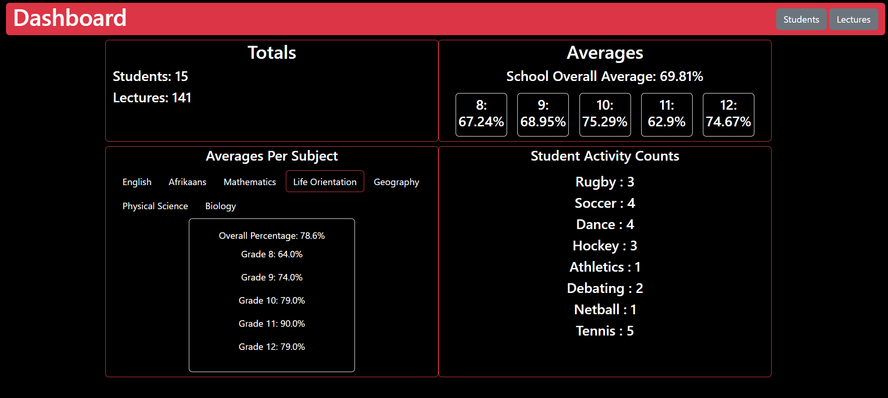
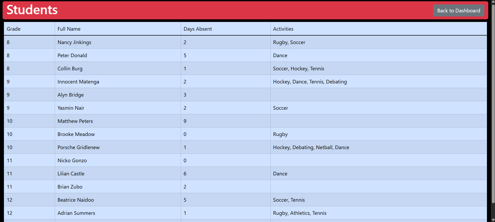
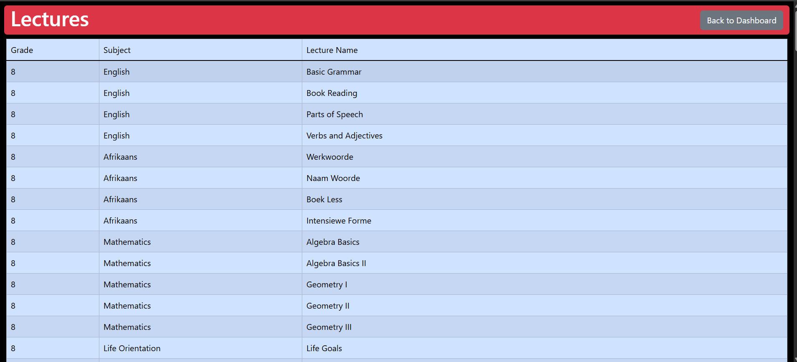

# School Dashboard Project - Ruby on Rails

## Project Specs
- Ruby Version: 3.4.5
- Rails Version: 8.0.2
- Uses an SQLite database

### Contents
- [Description](#description)
- [Features](#features)
- [Running Project](#running-project)
- [Visuals](#visuals)
- [Future Development and Improvement](#future-development-and-improvement)

# Description
This is a demo project with a primary goal to show KPI data on a dashboard aimed at providing 
insightful data for a hypothetical school.

Please see the 'progress_track" directory for more on the database design implemented and limits and blockers encountered.

# Features

This project features a dashboard showing data averages for subjects. 
It includes percentages per grade and per subject in addition to a selection tool to navigate between grades. 
Two additional pages have been added in to show tabular data for students and lectures (school classes) 

# Running Project

To run the project, you will need to have Ruby installed on your system.

1) Clone the current repo using 'git clone [repo url]'
2) Using a desired IDE, navigate into the created directory
3) Run 'bundle install; in a terminal
4) The database for this project is <b>not</b> tracked by Git and will require you to populate it
5) The controllers, models and test functions are already included

## Creating the Tables in your database
The migration files to create the tables in the database is included in the clone 
You can confirm this by checking the db/migrate folder and you will see the migration files

In an Ubuntu terminal at the project root, run the command: "rails db:migrate"

### These are the migrations that were run to create the migration files

When cloning the repo, you do not need to run these

- rails generate model Student grade:references full_name:string absent_days:integer
- rails generate model Grade grade_value:integer
- rails generate model Lecture grade:references subject:references name:string
- rails generate model Subject subject_name:string mandatory_pass:boolean
- rails generate model Percentage student:references subject:references percentage_value:float
- rails generate model Activity name:string 
- rails generate model Involvement student:references activity:references

## Database Population
To be able to see data immediately, there is a script located in the script folder called "populate_db.rb" 
To run this script, in the same Ubuntu terminal at the project root run:  
rails runner script/populate_db.rb

## Starting the project
In the same Ubuntu terminal, run: "rails server" which will start the project up
It can be viewed at 'http://localhost:3000/'

# Visuals
<h4>Fig 1. Dashboard Page</h4>

<h4>Fig 2. Students Page</h4>

<h4>Fig 3. Lectures Page</h4>

# Future Development and Improvement

1) The project is currenly a 'skeleton'. Future development would start with better and more refined 
error handling across the project

2) The Database queries are very expensive through the loops used, future development must look into making  these more efficient through combinations of better use of Ruby queries, evaluation of database relationships  to find where data is inefficiently linked

3) Styling changes as the site is currently highly simplistic

4) Although mobile responsiveness has been built in, more work can be done

5) Additional features would include better display of data instead of raw, numerical text. These would include the use of graphs, heatmaps and tables

6) Security - Although the project is hypothetical, the concept is still non-public, fake data and  
and would need authentication to be present.
